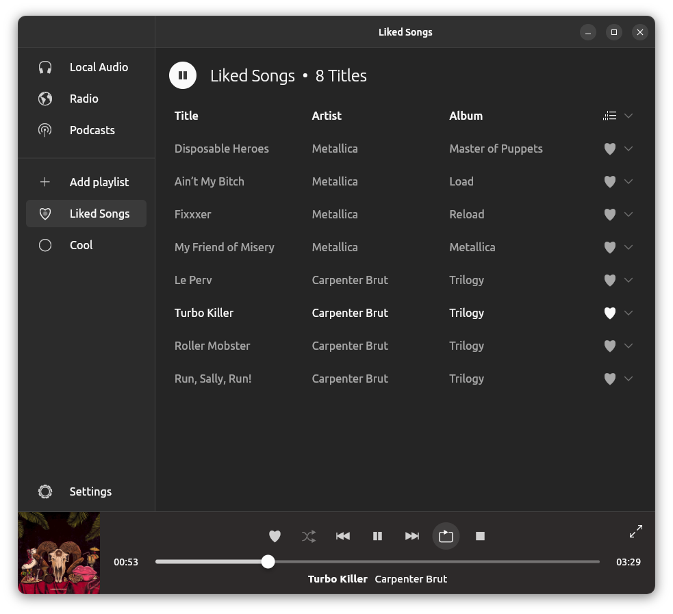
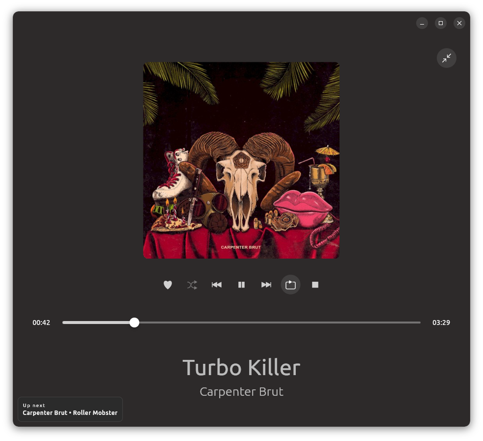
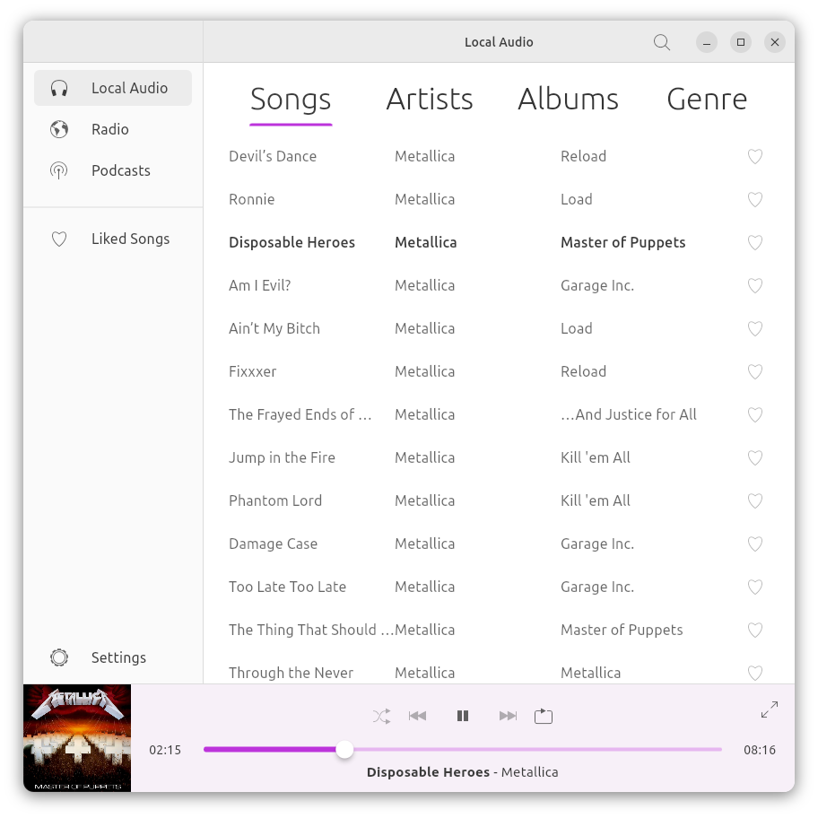
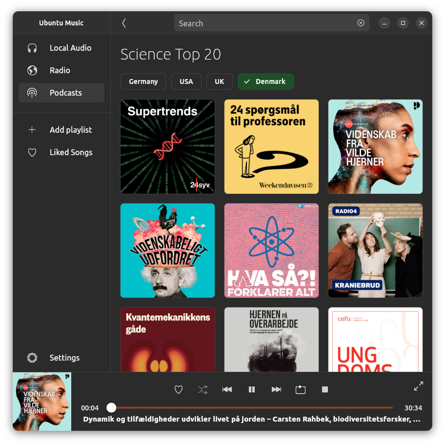
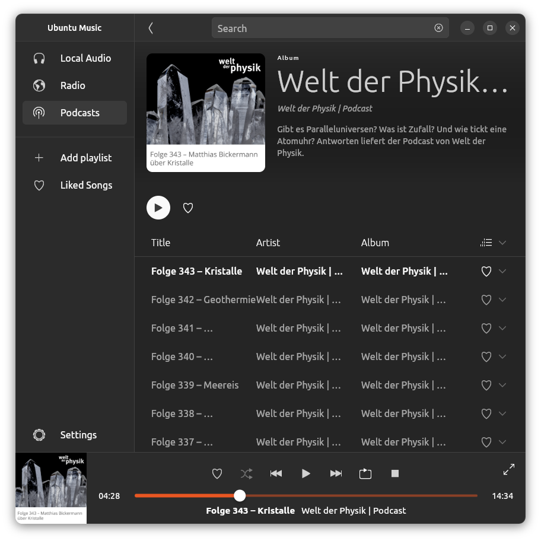

# Ubuntu Music - WIP

Music, Radio and Podcast player for Ubuntu made with Flutter.

| | |
|-|-|
|||
|||
| |  |

## Planed features

- [X] play local audio files
- [X] Filter local files
- [X] set root directory
- [X] play internet radio streams
- [ ] browse for radio stations
- [X] play podcasts
- [ ] download podcasts
- [X] search for podcasts
- [X] filter podcasts by country
- [ ] filter podcasts by genre
- [X] Save playlists
- [X] Save liked songs
- [ ] Save settings on disk
