# Musicpod

Music, Radio and Podcast player for ***Ubuntu*** made with Flutter.

Windows, MacOs, Android and other Linux Distributions support are WIP.

INSTALL FOR UBUNTU:

|Dark | Light|
|-|-|
||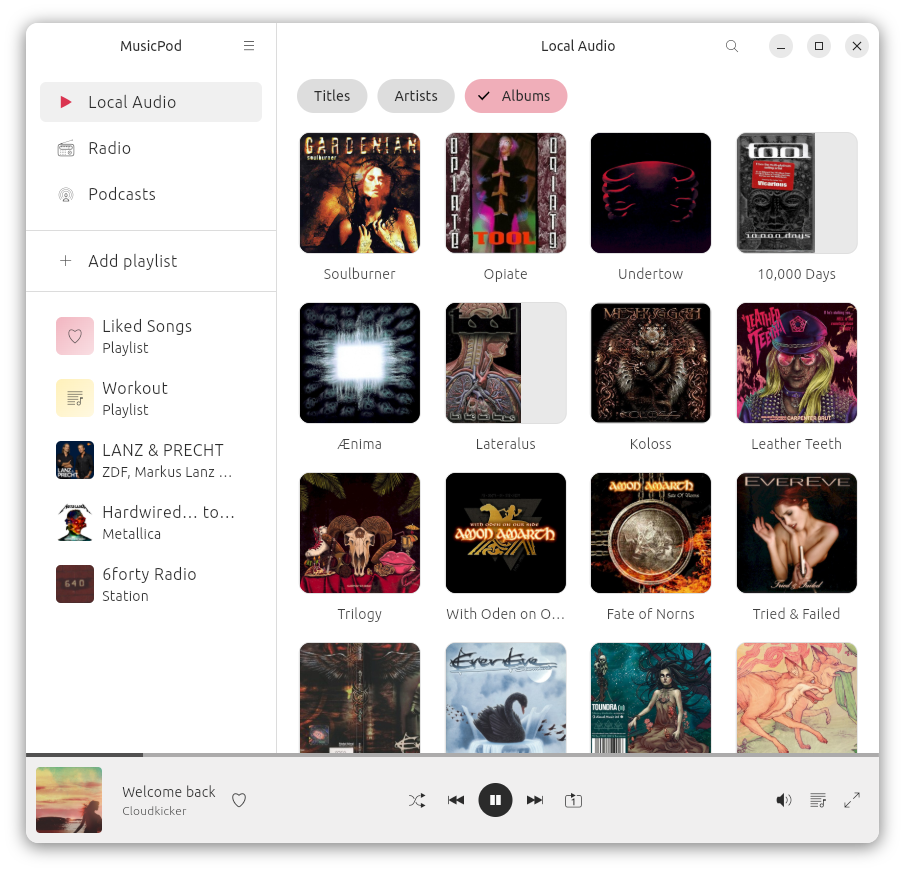|
|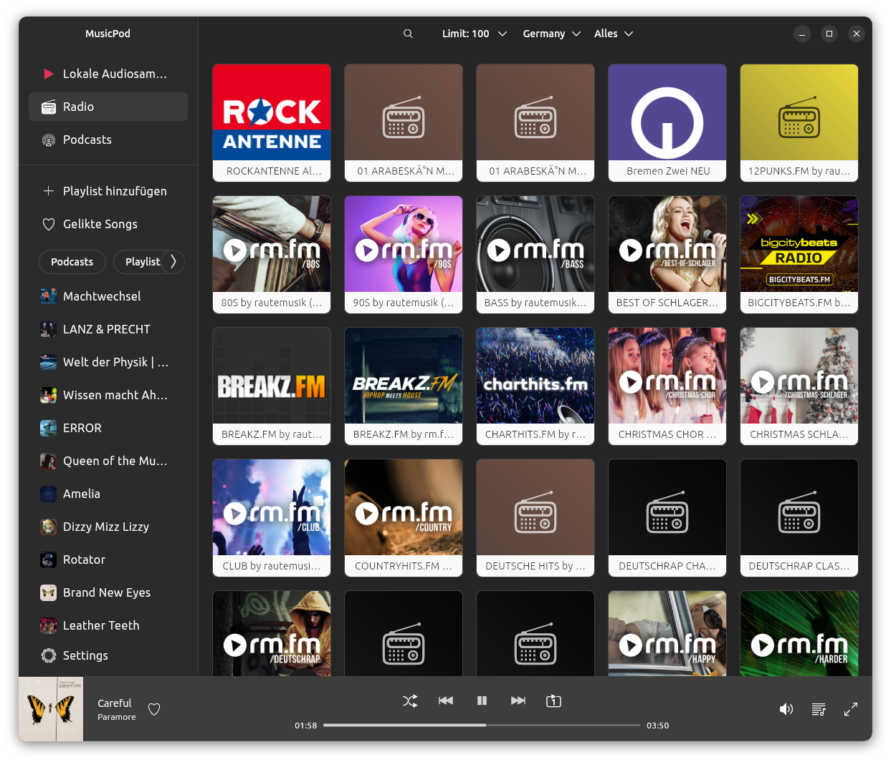|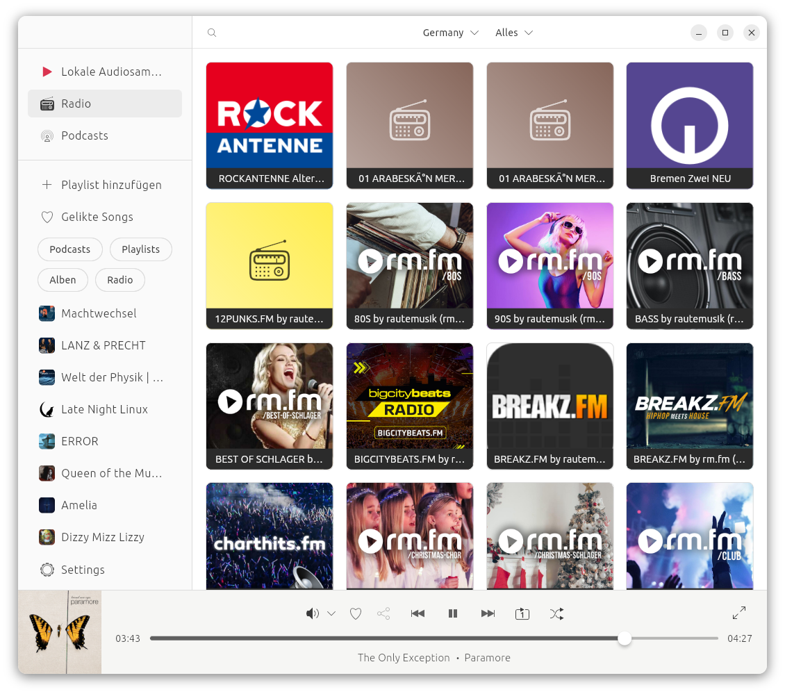|
|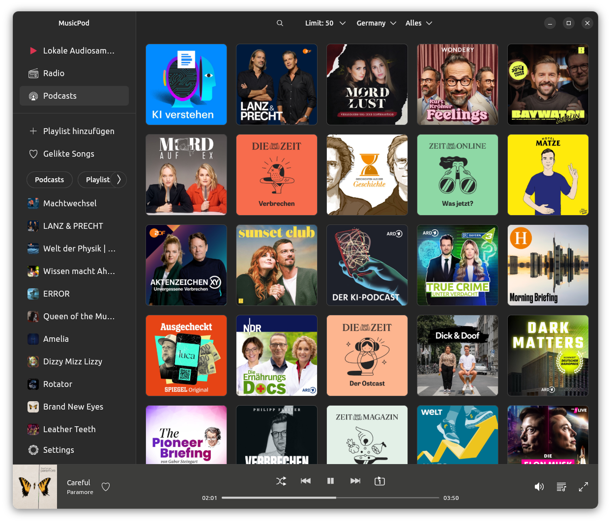|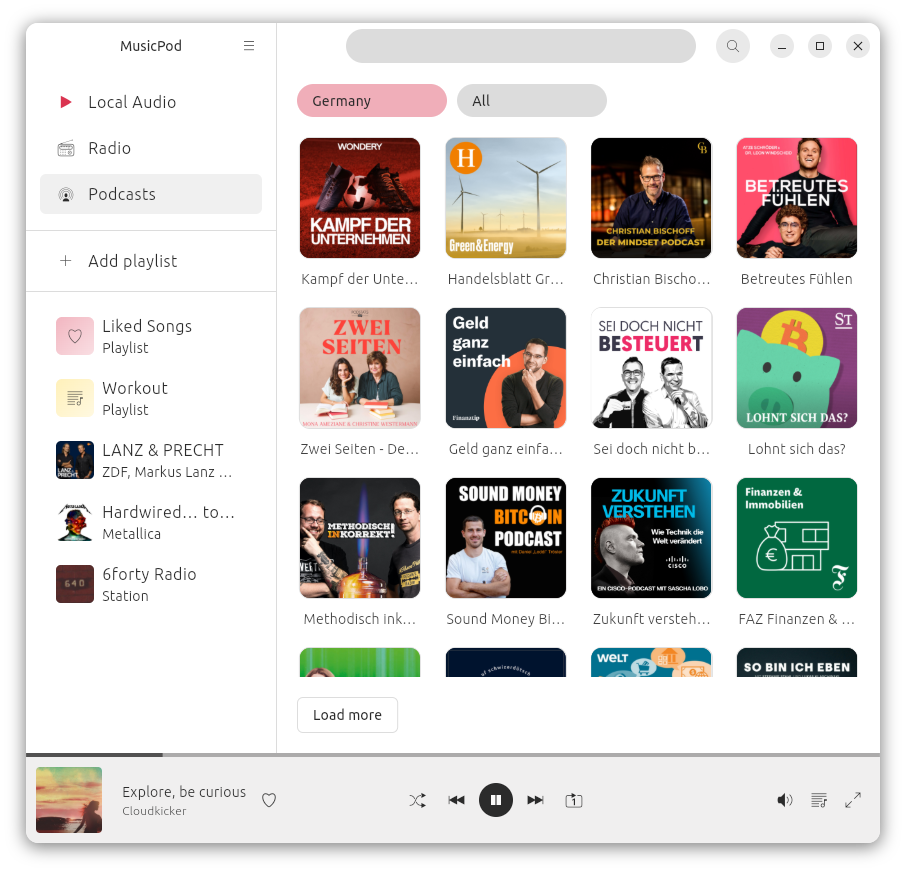|
|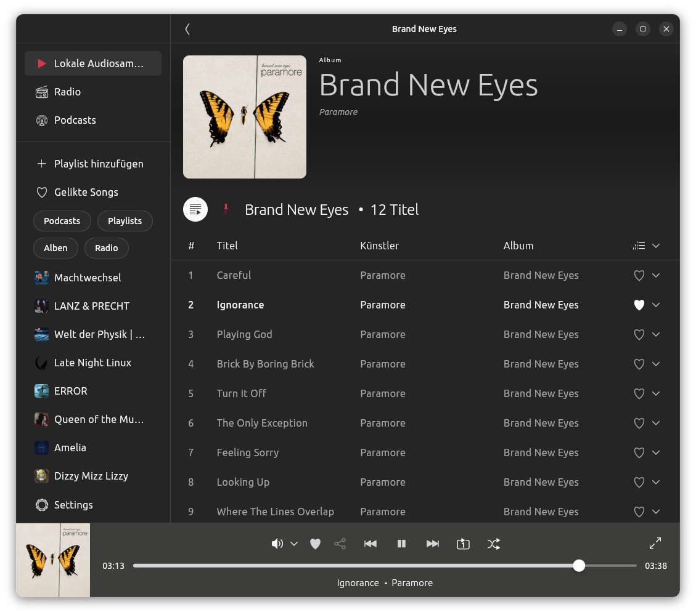|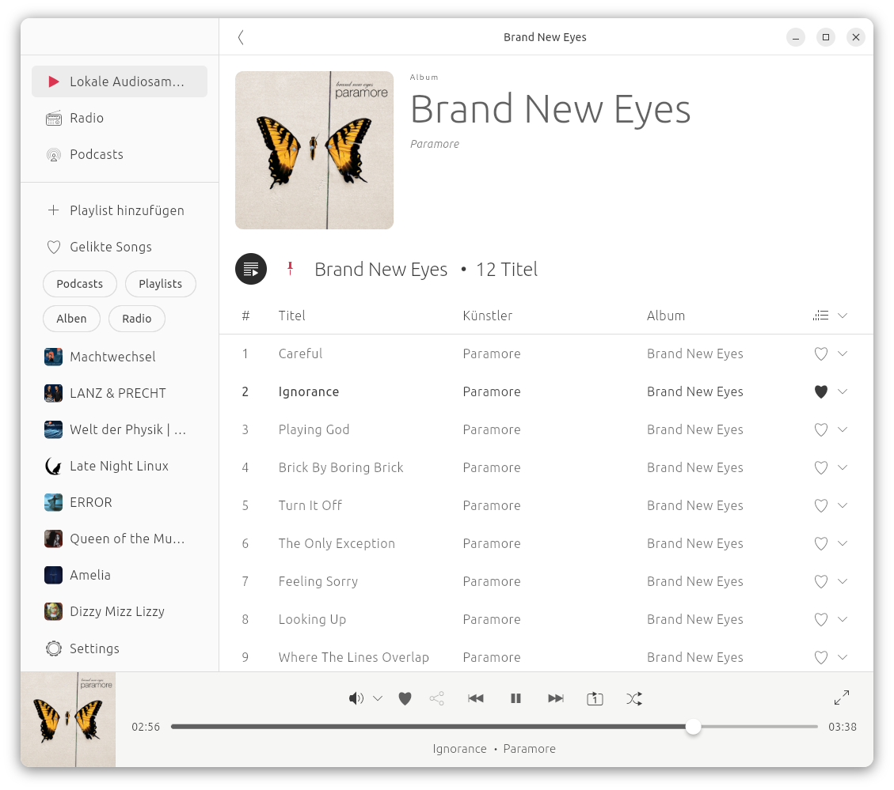|
|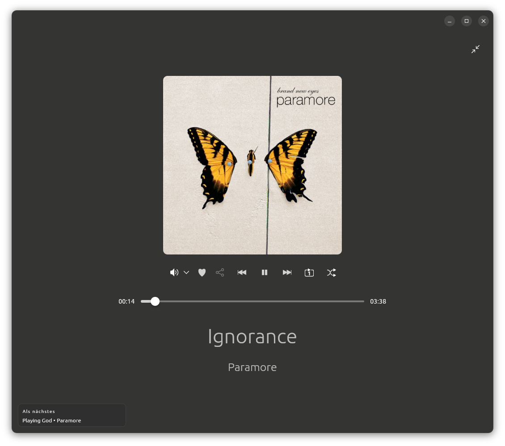|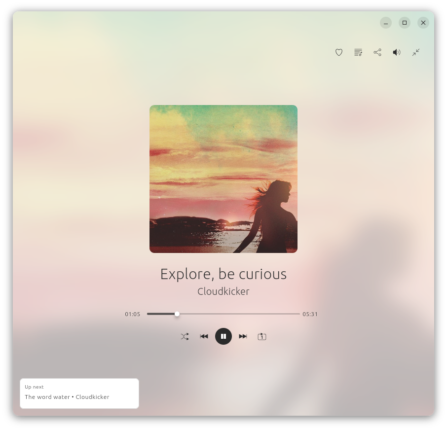|
|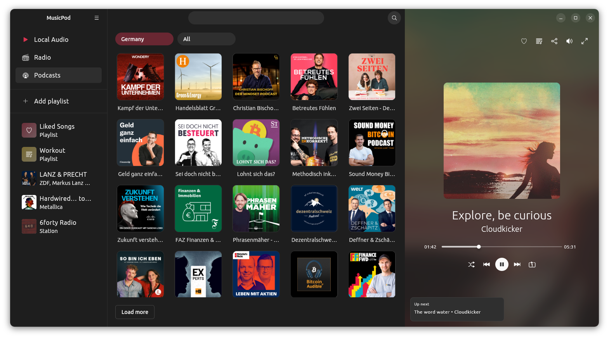|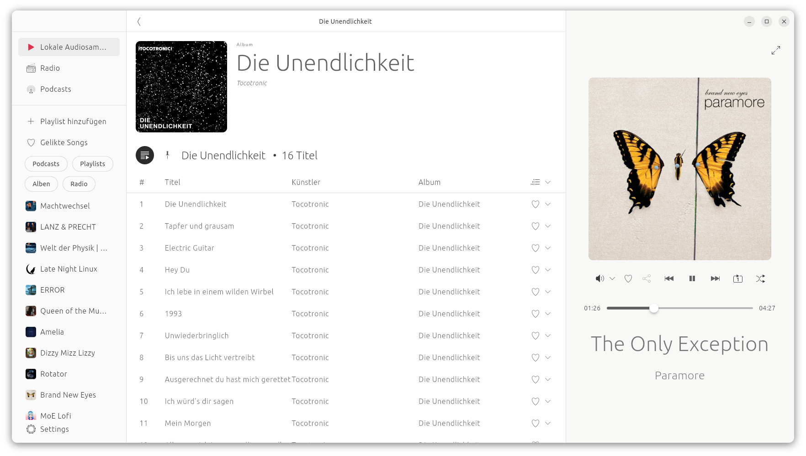|

## Credits

Thank you @amugofjava for creating the very easy to use and reliable [podcast_search](https://github.com/amugofjava/podcast_search)!

Thanks @alexmercerind for the super performant [Mediakit library](https://github.com/alexmercerind/media_kit) and [mpris_service](https://github.com/alexmercerind/mpris_service) dart implementation!

Thank you @KRTirtho for the very easy to use [Metadata God](https://github.com/KRTirtho/metadata_god) package

Thank you @tomassasovsky for the [dart implementation of radiobrowser-api](https://github.com/tomassasovsky/radio-browser-api.dart)

## MusicPod Level 1

- [X] play local audio files
- [X] filter local files
- [X] set root directory
- [X] create and manage playlists
- [X] play internet radio streams
- [X] browse for radio stations
- [X] play podcasts
- [X] search for podcasts
- [X] load podcast charts
- [X] filter podcasts by country
- [X] filter podcasts by genre
- [X] save playlists
- [X] save liked songs
- [X] save settings on disk
- [X] notify when a new episode of your subscribed podcasts is available

## MusicPod Level 2

- [X] Video Podcasts ([#71](https://github.com/ubuntu-flutter-community/musicpod/issues/71))
- [ ] Chromecast Support ([#91](https://github.com/ubuntu-flutter-community/musicpod/issues/91))
- [ ] Big feature: add a shop to buy digital audio for your collection
- [X] streaming provider agnostic sharing links
- [X] tag-grid view for the radio page
- [ ] option to download podcasts
- [ ] reduced memory allocation

## Supported operating systems and package formats

- [X] Ubuntu Desktop
  - [X] [snap package](https://snapcraft.io/musicpod) (this is the primary supported package!)
  - [ ] Flatpak ([WIP](https://github.com/ubuntu-flutter-community/musicpod/issues/10))
- [X] Windows Support (Media Controls are WIP)
  - [ ] Windows Store
  - [ ] Direct Download
- [X] Android Support (Media Controls are WIP)
  - [ ] PlayStore
  - [ ] APK Download
- [ ] MacOs Support
