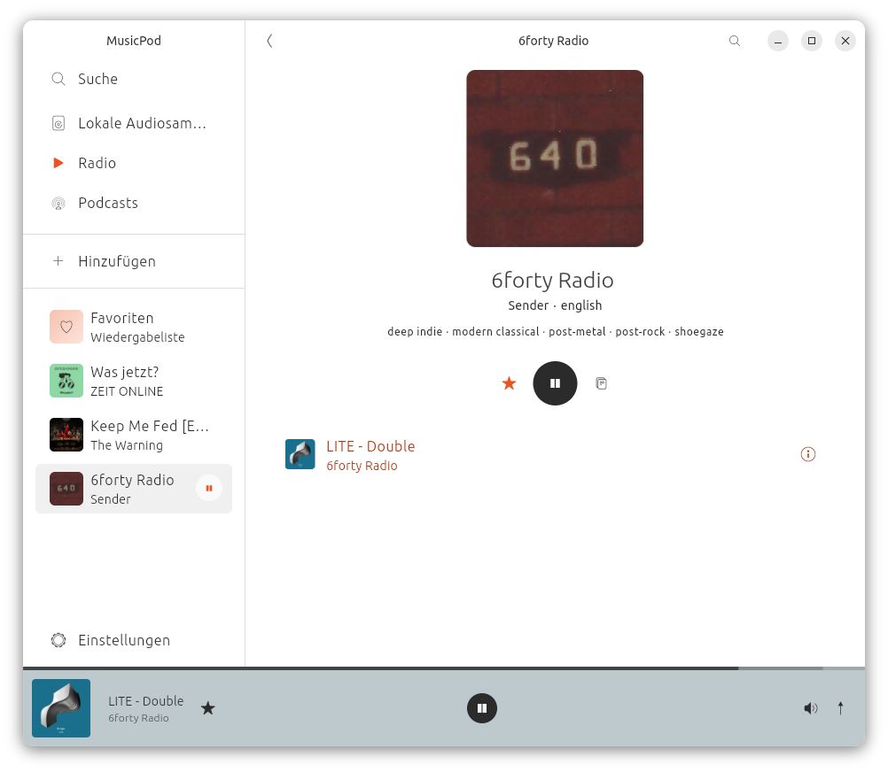
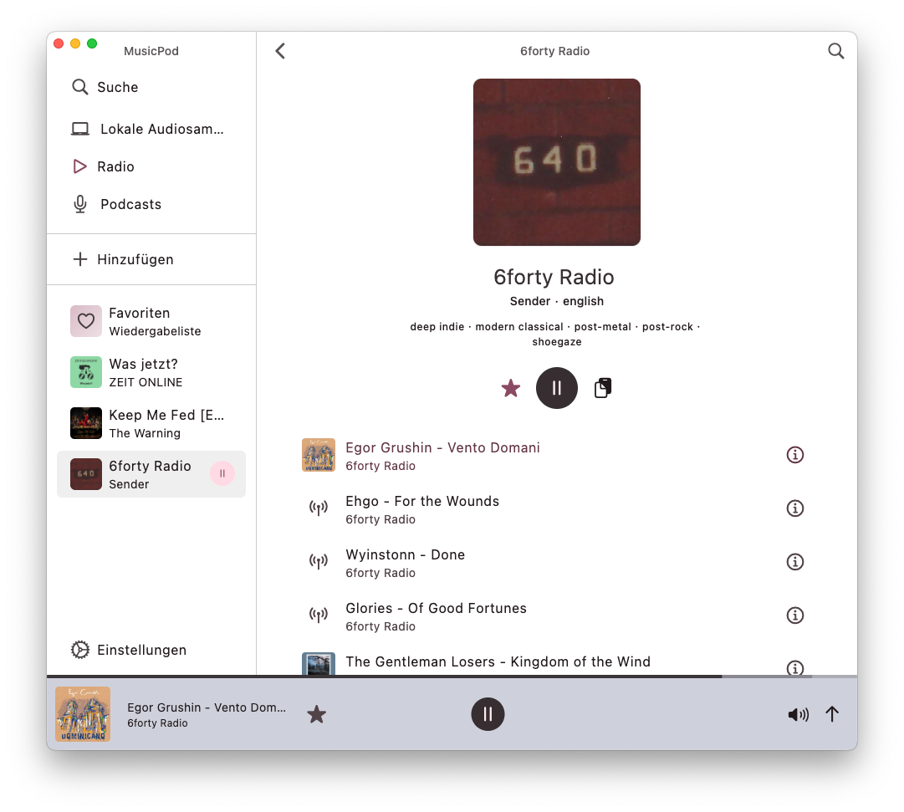

# MusicPod

MusicPod is a local music, radio, television and podcast player for Linux Desktop, MacOS and Windows. (Android is planed but no ETA yet when it will happen.)

|OS|How to install|
|-|-|
|Linux|   or   |
|Windows|[Release Page](https://github.com/ubuntu-flutter-community/musicpod/releases)|
|MacOS|[Release Page](https://github.com/ubuntu-flutter-community/musicpod/releases)|
|Android|WIP|

## Features

|Features | Dark Linux | Light Linux | Dark MacOS | Light MacOS | 
|-|-|-|-|-|
|Play local audio|||||
|Find local audios sorted by [Metadata](https://github.com/ClementBeal/audio_metadata_reader) |||||
|Play radio stations, with icytags and artwork looked up!|||||
|Play and download podcasts, safe progress, sort episodes and more!|||||
|Video podcast support!|||||
|Discover podcasts, filtered as you like|||||
|Discover radio stations, filtered as you like|||||
|Different view modes|||||

## Credits

Thanks to all the [MPV](https://github.com/mpv-player/mpv) contributors!

Thank you [@amugofjava](https://github.com/amugofjava) for creating the very easy to use and reliable [podcast_search](https://github.com/amugofjava/podcast_search)!

Thanks [@alexmercerind](https://github.com/alexmercerind) for the super performant [Mediakit library](https://github.com/alexmercerind/media_kit) and [mpris_service](https://github.com/alexmercerind/mpris_service) dart implementation!

Thank you [@KRTirtho](https://github.com/KRTirtho) for the very easy to use [smtc_windows](https://github.com/KRTirtho/smtc_windows) package!

Thank you [@tomassasovsky](https://github.com/tomassasovsky) for the [dart implementation of radiobrowser-api](https://github.com/tomassasovsky/radio-browser-api.dart)!

Thank you [@ClementBeal](https://github.com/ClementBeal) for the super fast, pure dart [Audio Metadata Reader](https://github.com/ClementBeal/audio_metadata_reader)!

Thank you [@escamoteur](https://github.com/escamoteur) for creating [get_it](https://pub.dev/packages/get_it) and [watch_it](https://pub.dev/packages/watch_it), which made my application faster and the source code cleaner!

## Contributing

Contributions are highly welcome. Especially translations.
Please [fork](https://docs.github.com/en/pull-requests/collaborating-with-pull-requests/working-with-forks/fork-a-repo) MusicPod to your GitHub namespace, [clone](https://docs.github.com/de/repositories/creating-and-managing-repositories/cloning-a-repository) it to your computer, create a branch named by yourself, commit your changes to your local branch, push them to your fork and then make a pull request from your fork to this repository.
I recommend the vscode extension [GitHub Pull Requests](https://marketplace.visualstudio.com/items?itemName=GitHub.vscode-pull-request-github) especially for people new to [Git](https://git-scm.com/doc) and [GitHub](https://docs.github.com/en/get-started/start-your-journey).

## Translations
For translations into your language change the corresponding `app_xx.arb` file where `xx` is the language code of your language in lower case.
If the file does not exist yet please create it and copy the `whole` content of app_en.arb into it and change only the values to your translation but leave the keys untouched.
The vscode extension [arb editor by Google](https://marketplace.visualstudio.com/items?itemName=Google.arb-editor) is highly recommended to avoid arb syntax errors.
Also recommended is the [Google Translate Extension](https://marketplace.visualstudio.com/items?itemName=funkyremi.vscode-google-translate).

## Code contributions

If you find any error please feel free to report it as an issue and describe it as good as you can.
If you want to contribute code, please create an issue first.

## Testing

Test mocks are generated with [Mockito](https://github.com/dart-lang/mockito). You need to run the `build_runner` command in order to re-generate mocks, in case you changed the signatures of service methods.

`dart run build_runner build`

## Boring developer things

### Under the flutter hood

MusicPod is basically a fancy front-end for [MPV](https://github.com/mpv-player/mpv)! Without it it would still look nice, but it wouldn't play any media :D!

### Architecture: [model, view, viewmodel (MVVM)](https://en.wikipedia.org/wiki/Model%E2%80%93view%E2%80%93viewmodel)

The app, the player and each page have their own set of widgets, 1 view model and 1 service.
There are additional view models for downloads or a service for all external path things but that's it.

Since all views need access to each other all the time, disposing the view models all the time makes no sense and is CPU intensive for no need so all services and view models are registered as singletons before the flutter tree is created.

Important services are also initialized once before the Flutter `runApp` call, the view models are initialized when the view is accessed but most of the internal calls are skipped when the views are accessed again after that.

### Dependency choices, dependency injection and state management

Regarding the packages to implement this architecture I've had quite a journey from [provider](https://pub.dev/packages/provider) to [riverpod](https://pub.dev/packages/riverpod) with [get_it](https://pub.dev/packages/get_it).

I found my personal favorite solution with [get_it](https://pub.dev/packages/get_it) plus its [watch_it](https://pub.dev/packages/watch_it) extension because this fits the need of this application the most without being too invasive into the API of the flutter widget tree.

This way all layers are clearly separated and easy to follow, even if this brings a little bit of boilerplate code.

I am a big fan of the [KISS principle](https://en.wikipedia.org/wiki/KISS_principle) (keep it simple, stupid), so when it comes to organizing software source code and choosing architectural patterns simplicity is a big goal for me.

Though performance is the biggest goal, especially for flutter apps on the desktop that compete against toolkits that are so slim and performant they could run on a toaster (exaggeration), so if simple things perform badly, I am willing to switch to more complicated approaches ;)

### Persistence

Preferences are stored with [shared_preferences](https://pub.dev/packages/shared_preferences).